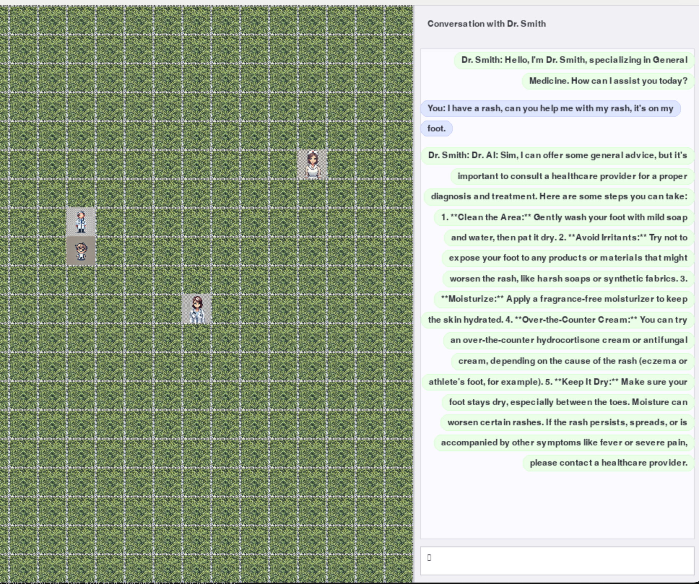
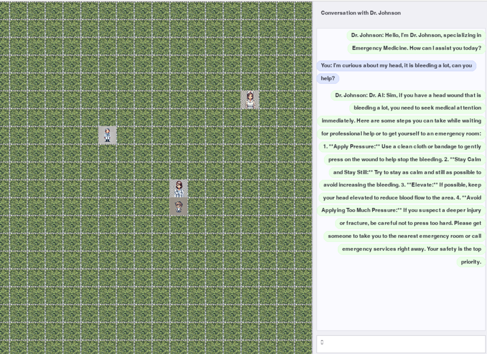

## Medical Simulacra

A python simulation of multiple medical agents. Navigate the environment and talk to agents.


## Running the code

```bash
cd medical-simulacra
pip install -r requirements.txt
python main.py
````

This assumes you have an open ai API key named OPENAI_API_KEY in a .env file in the folder